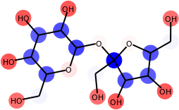
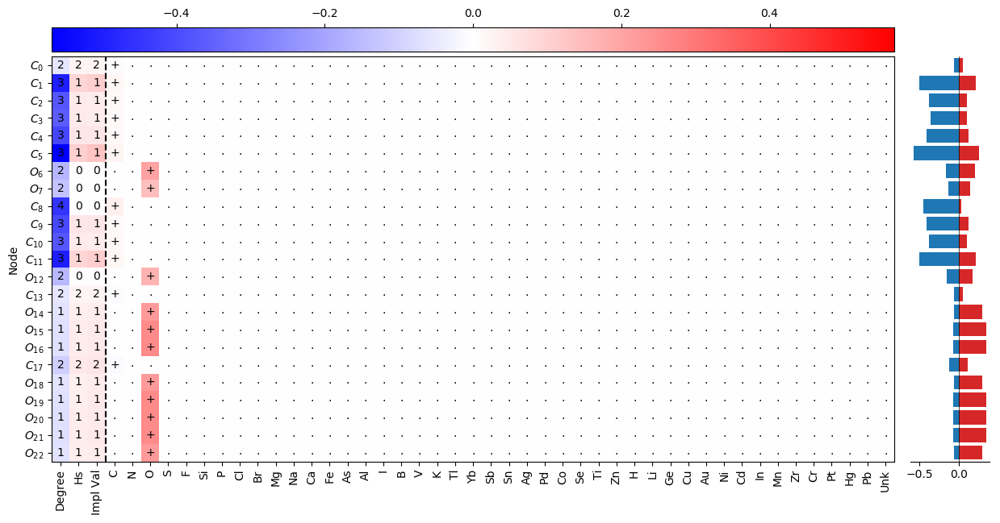
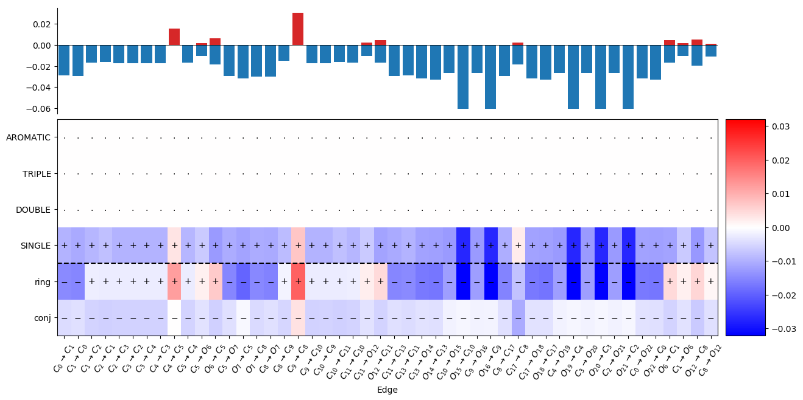

# Explainability Techniques for Graph Convolutional Networks

Code and notebooks for the paper ["Explainability Techniques for Graph Convolutional Networks"](https://arxiv.org/abs/1905.13686) 
accepted at the ICML 2019 Workshop ["Learning and Reasoning with Graph-Structured Data"](https://graphreason.github.io/).

## Overview
A Graph Network trained to predict the solubility of organic molecules is applied to _sucrose_, 
the prediction is explained using [Layer-wise Relevance Propagation](http://heatmapping.org) that assigns 
positive and negative relevance to the nodes and edges of the molecular graph: 



The predicted solubility can be broken down to the individual features of the atoms and their bonds:




## Code structure
- `src`, `config`, `data` contain code, configuration files and data for the experiments
  - `infection`, `solubility` contain the code for the two experiments in the paper
  - `torchgraphs` contain the core graph network library
  - `guidedbackrprop`, `relevance` contain the code to run Guided Backpropagation and Layer-wise Relevance Propagation on top of PyTorch's `autograd`
- `notebooks`, `models` contain a visualization of the datasets, the trained models and the results of our experiments
- `test` contains unit tests for the `torchgraphs` module (core GN library)
- `conda.yaml` contains the conda environment for the project

## Setup
The project is build on top of Python 3.7, PyTorch 1.1+, 
[torchgraphs](https://github.com/baldassarreFe/torchgraphs) 0.0.1 and many other open source projects.

A [Conda](https://conda.io) environment for the project can be installed as: 
```bash
conda env create -n gn-exp -f conda.yaml
conda activate gn-exp
python setup.py develop
pytest
```

## Training
Detailed instructions for data processing, training and hyperparameter search can be found in the respective subfolders:  
- Infection: [infection/notes.md](./src/infection/notes.md)
- Solubility: [solubility/notes.md](./src/solubility/notes.md)

## Experimental results
The results of our experiments are visualized through the notebooks in [`notebooks`](./notebooks):
```bash
conda activate gn-exp
cd notebooks
jupyter lab 
```
